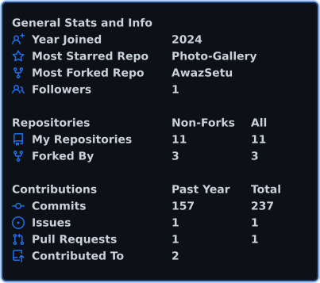
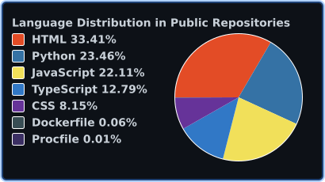
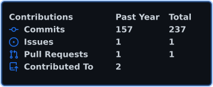

<!-- ===================== CONTRIBUTION SNAKE ===================== -->

<p align="center">
  <picture>
    <source
      media="(prefers-color-scheme: dark)"
      srcset="https://raw.githubusercontent.com/SilentK15/SilentK15/output/github-snake-dark.svg"
    />
    <source
      media="(prefers-color-scheme: light)"
      srcset="https://raw.githubusercontent.com/SilentK15/SilentK15/output/github-snake.svg"
    />
    
  </picture>
</p>

<!-- ===================== HEADER ===================== -->

<div align="center">


<br>

```text
🎓 BE Information Technology Student
💻 Full-Stack Developer  
🚀 Building things that matter
```

<br>

<a href="https://github.com/SilentK15">

</a>&nbsp;
<a href="https://www.linkedin.com/in/kshitij-shete-6b55512b6/">

</a>&nbsp;


</div>

<br>

---

##  About Me

```yaml
name: Kshitij Shete
location: India
education: BE in Information Technology (2nd Year)
currently_learning: [ "Spring Boot", "React", "System Design" ]
interests: [ "Full-Stack Dev", "APIs", "Databases", "Dev Tools" ]
fun_fact: "I turn ☕ into <code/>"
```

- 🔭 I'm currently working on **full-stack web applications**
- 🌱 I'm learning **Spring Boot, React & modern backend architectures**
- 🏆 Participated in **hackathons and dev competitions**
- 💬 Ask me about **Java, Python, JavaScript, or Web Dev**
- ⚡ Fun fact: I debug in my dreams 🛌💻

---

## 🛠️ Tech Stack

<table>
<tr>
<td align="center" width="150"><b>Languages</b></td>
<td>

</td>
</tr>
<tr>
<td align="center" width="150"><b>Frontend</b></td>
<td>

</td>
</tr>
<tr>
<td align="center" width="150"><b>Backend</b></td>
<td>

</td>
</tr>
<tr>
<td align="center" width="150"><b>Database</b></td>
<td>

</td>
</tr>
<tr>
<td align="center" width="150"><b>Tools</b></td>
<td>

</td>
</tr>
</table>

---

## 📊 GitHub Stats

<!-- Stats are auto-generated daily by GitHub Actions → self-hosted SVGs, always reliable -->

<div align="center">

<picture>
  <source media="(prefers-color-scheme: dark)" srcset="./profile/stats.svg" />
  
</picture>

<br><br>

<picture>
  <source media="(prefers-color-scheme: dark)" srcset="./profile/top-langs.svg" />
  
</picture>

<br><br>

<picture>
  <source media="(prefers-color-scheme: dark)" srcset="./profile/contributions.svg" />
  
</picture>

</div>

---

## 🏆 GitHub Trophies

<div align="center">


</div>

---

<!-- ===================== FOOTER ===================== -->

<div align="center">


<br>

### ✨ Thanks for visiting!

<a href="https://github.com/SilentK15?tab=repositories">

</a>&nbsp;
<a href="https://www.linkedin.com/in/kshitij-shete-6b55512b6/">

</a>

</div>
